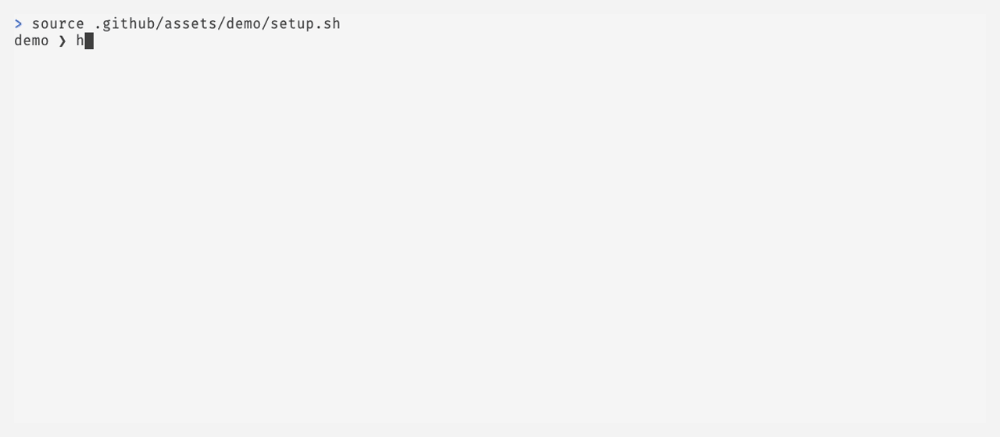

# herdr-pane-name

[](https://github.com/go-min/herdr-pane-name/actions/workflows/ci.yml)
[](https://github.com/go-min/herdr)

Cross-platform [Herdr](https://github.com/go-min/herdr) plugin that derives tab
and pane names from the foreground process. It preserves labels changed by the
user, adds `1:`–`9:` jump-key prefixes, and supports zsh, Bash, and fish hooks.

> [!NOTE]
> This plugin is maintained primarily for the organization's own use and is
> shared as-is. It has no public support, roadmap, or response-time
> commitments. Forks are welcome for different workflows or priorities.

## What you get

After installing the plugin, Herdr will provide:

- automatic tab names based on the foreground process in the focused pane;
- automatic pane names based on each pane's own foreground process;
- automatic updates on Herdr startup, lifecycle events, focus changes, and
  workspace reordering;
- optional zsh, Bash, and fish hooks for updates immediately after commands
  start or finish;
- dynamic `1:`–`9:` jump-key prefixes for workspaces, tabs, and panes;
- preserved manual names: `1:review` becomes `2:review` when moved, while
  `review` remains fully manual and is not replaced by a process name;
- built-in icons for many popular tools, without replacing their process
  names;
- configuration for ignored programs, maximum name length, command arguments,
  and icons;
- `sync`, `reset`, and `clear` actions for manual control;
- cross-platform operation without Bash, `jq`, or a platform-specific socket
  dependency.

Agent display names receive numeric prefixes through Herdr metadata. Semantic
agent names, lifecycle state, and session restore identity remain unchanged.

<picture>
  <source media="(prefers-color-scheme: dark)" srcset=".github/assets/demo/demo-dark.gif">
  <source media="(prefers-color-scheme: light)" srcset=".github/assets/demo/demo-light.gif">
  
</picture>

## Requirements

- [Herdr](https://github.com/herdrdev/herdr) 0.9.3 or newer (including the running server)
- Rust 1.80+ to build from source

The plugin itself uses only the Herdr CLI exposed through `HERDR_BIN_PATH`; it
does not require Bash, `jq`, or a platform-specific socket implementation.

## Install

Install the published GitHub plugin directly through Herdr:

```sh
herdr plugin install go-min/herdr-pane-name -y
```

The plugin builds itself from the manifest, registers its startup and
lifecycle hooks, and persists across Herdr restarts. Verify the installation:

```sh
herdr plugin list
herdr plugin config-dir herdr.pane-name
```

The built-in Herdr events handle workspace/tab/pane lifecycle and focus
changes. This is enough for installation, focus changes, and Herdr lifecycle
events. For updates immediately after arbitrary shell commands, add the
optional [shell integration](#shell-integration) from a local checkout.

## Shell integration

Shell hooks are optional. They make names update immediately after commands
start or finish; without them, the plugin still updates on Herdr lifecycle and
focus events. The hooks are available for [zsh](hooks/zsh.zsh),
[Bash](hooks/bash.bash), and [fish](hooks/fish.fish).

From a local checkout, source the hook for your current shell:

```sh
export HERDR_PANE_NAME_BIN="$PWD/target/release/herdr-pane-name"
source hooks/zsh.zsh       # zsh
source hooks/bash.bash     # Bash
source hooks/fish.fish     # fish
```

The hooks discover the installed plugin configuration automatically. When
`HERDR_PANE_NAME_BIN` is not set and the binary is not on `PATH`, they call the
installed Herdr plugin action directly, so a GitHub-installed plugin does not
need a second binary installation. All Herdr communication and JSON handling
is implemented by the Rust binary.

## Configuration

Copy [`config.example.toml`](config.example.toml) to the directory printed by
`herdr plugin config-dir herdr.pane-name`. The plugin reloads it on every
event, so editing it does not require a restart.

The shell hooks discover this directory automatically. Set
`HERDR_PLUGIN_CONFIG_DIR` yourself only when you need to override it. Set
`HERDR_PANE_NAME_BIN` to an absolute or repository-relative path when the
binary is not available as `herdr-pane-name` in `PATH`.

```toml
max_length = 32
show_args = true
icons = true
prefixes = true
terminal_titles = false
ignored_programs = ["ssh", "top"]
```

`max_length` includes the numeric prefix. `show_args` appends up to three
command arguments. Icons are enabled by default. When `icons = true`, the
plugin prepends a built-in Nerd Font glyph to the process name, for example
`1: nvim`; it never replaces the process name. The catalog covers common
shells, editors, languages, package managers, containers, cloud tools,
databases, and terminal utilities. The plugin has built-in support for many
popular tools; the complete mapping is available in
[`src/icons.rs`](src/icons.rs).
Correct icon rendering requires a
[Nerd Font-compatible font](https://www.nerdfonts.com/). Unknown programs
keep their normal process name.

Set `terminal_titles = true` to prefer each pane's nonempty
`terminal_title_stripped` (its OSC title with a leading activity glyph removed)
for automatic pane and tab names. Empty titles fall back to foreground process
names. Process ignore rules still apply; title names use the same length limit
and numeric prefixes, without process icons or arguments. This is disabled by
default because applications control their own OSC titles.

Tab positions are counted independently inside each workspace, and pane
positions independently inside each tab. Only positions 1–9 receive a
numeric prefix. Workspace names keep Herdr's default base name and receive
only their workspace prefix. Agent positions are counted independently inside
each workspace, in the order returned by Herdr's snapshot. Their display base
is the existing display name, semantic name, or detected agent kind. Later
manual display-name changes are preserved until the agent occupant changes.
`clear` and `reset` restore the previous display name only while the plugin
still owns the current value.

For example, a manually renamed tab `1:review` remains `review` as its base
name. If it becomes the second tab, the plugin changes it to `2:review`; it
does not replace `review` with the foreground process. Manually assigned
names without a plugin-owned prefix are left unchanged.

## Commands

Invoke these actions through Herdr:

```sh
herdr plugin action invoke herdr.pane-name.sync
herdr plugin action invoke herdr.pane-name.reset
herdr plugin action invoke herdr.pane-name.clear
```

- `sync` immediately synchronizes automatic tab and pane names.
- `reset` removes only labels owned by this plugin and forgets ownership.
- `clear` removes plugin-owned labels but keeps the ownership state, so the
  next automatic update can restore them.

Manual labels are never touched.

The plugin stores ownership state in `labels.json` under Herdr's plugin config
directory. It does not read or write the repository checkout after install.

## API boundary

The plugin reads workspace, tab, pane, and agent records with a single
`herdr api snapshot` call per synchronization. Foreground process argv still
comes from `pane process-info`. Agent prefixes use `pane report-metadata`
with `--display-agent` and an agent guard, never `agent rename` or lifecycle
reports.

Herdr does not expose a first-class automatic/manual label ownership field.
The plugin keeps its `labels.json` ownership state, including previous agent
display names and the mapping from stable `terminal_id` to current `pane_id`.
Synchronization holds an OS file lock across reads, mutations, and state writes,
so concurrent event and shell hooks cannot adopt each other's labels.
This preserves pane ownership and manual prefix bases when a live terminal
moves between workspaces. Existing state files migrate on the first sync;
move tracking starts once that initial terminal mapping has been recorded.

There is no dedicated `pane.foreground_process_changed` event with argv.
`pane.updated` can signal OSC title changes, but does not replace command-level
updates. Optional shell hooks remain useful, including for title updates.
The plugin keeps short-lived manifest hooks rather than a socket subscriber
requiring reconnect and `events_lost` recovery.

## Development build and link

```sh
cargo test
cargo build --release
herdr plugin link .
```

The manifest contains event hooks for workspace, tab, pane, and agent lifecycle
changes, including workspace reordering, plus a startup sync. Herdr's event
hook is a short-lived process, so the plugin does not hold a raw socket open or
require a daemon.

## License

MIT. See [LICENSE](LICENSE).
